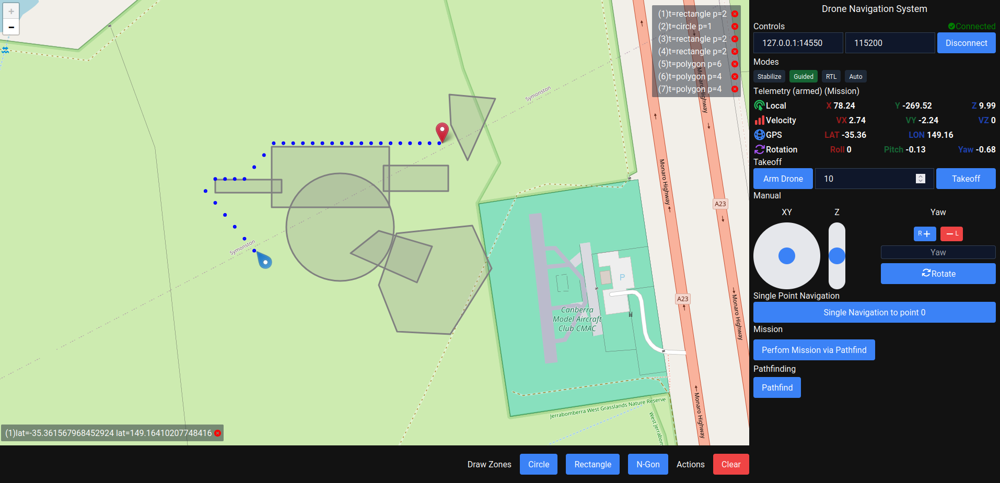

## Navigation System

A small two tier architecture (react/flask) drone navigation system.



## Table of Contents

- [Navigation System](#navigation-system)
- [Table of Contents](#table-of-contents)
- [Features](#features)
- [Tech Stack](#tech-stack)
  - [Installation](#installation)
  - [Usage](#usage)
- [Project scope](#project-scope)

## Features

- OSM Display and overlays
  - Point overlay for the drone position
  - Polygon and Circle representation for the no fly zones
  - Dot representation of pathfinder waypoints
  - Line representation of the drone path
- Connection to the drone via MAVLink protocol
  - Allows specifying the connection string and baud rate
- Four major modes of operation: STABILIZE, GUIDED, RTL, AUTO (MISSION)
- Telemetry thread to display: Local XYZ position and velocity, GPS lattiude and longitude, ROLL/PITCH/YAW rotation angles, current mode and armed status
- Arming and takeoff to a specified altitude
- Manual control of the drone XYZ via double joystick and YAW rotation.
  - 2D Joystick for XY movement
  - 1D Joystick for Z movement
- Single point navigation (click on the map) without pathfinder
- Single point navigation (click on the map) with pathfinder and no fly zone rule enforcement
- Multiple point navigation (click on the map) without pathfinder
- Drone path override via (GUIDED-> XYZ Joystick / YAW / Single Point Navigation)

## Tech Stack

Frontend has been built with **React** and **Leaflet**. **Tailwindcss** was used for the UI styling.

Backend has been built with **Flask** and **PyMavlink**. The backend is responsible for the MAVLink communication with the drone and allows a smooth websocket communication with the frontend. There is an **additional thread for telemetry** data retrieval and pushing it to the frontend.

**SocketIO** is set to be the main driver for the communication between the frontend and the backend.

### Installation

Copy the repository and install the required packages:

```bash
git clone https://github.com/Rafisto/navigation-system.git
cd navigation-system
# frontend
cd react
npm install
# backend
cd api
python -m venv venv
source venv/bin/activate
pip install -r requirements.txt
```

### Usage

Run via

```bash
# frontend
cd react
npm run dev
# backend
cd api
source venv/bin/activate
python app.py
```

## Project scope

Project scope has been defined by the following requirements:

1. Automatic flying along a given path
2. Rotating the drone to given angles
3. The ability to override the drone's path at any time
4. The ability to manually control the drone
5. No-fly zones in the shape of a circle, rectangle, and convex polygon (9-gon)

The project was finished on 22-11-2024.
